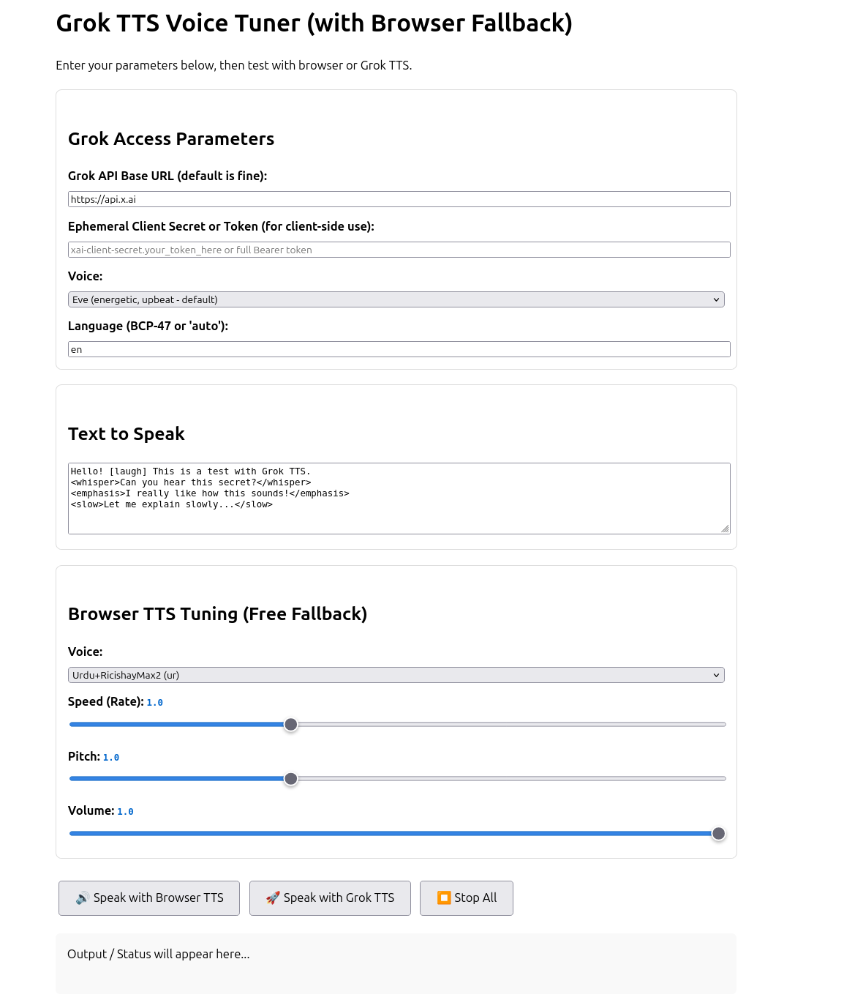

# GrokTTS_demo
test for grok tts


How to Use It

Save as grok-tts-tuner.html.
Open via a local server (recommended): npx serve or python -m http.server 8000, then visit http://localhost:8000/grok-tts-tuner.html in Chrome/Edge.
Fill in your Ephemeral Client Secret (recommended for browser safety) or full Bearer token.
Choose voice, add expressive tags in the text box (e.g. [laugh], <whisper>, <slow>, etc.).
Click Speak with Grok TTS to hear high-quality results.
Use the browser section for instant free tuning when you don't want to call the API.

Important notes:

For real use, get an ephemeral token from your backend (calling POST https://api.x.ai/v1/realtime/client_secrets with your main API key). Direct main key use in browser is risky.
Grok TTS costs money based on characters — test with short text first.
The REST /v1/tts returns audio directly (MP3 by default).

If you want a full realtime voice chat version (mic input → Grok STT → LLM → Grok TTS) or a tiny Node.js backend to generate ephemeral tokens safely

P2

# Grok TTS Voice Tuner Demo

A beautiful single-file HTML demo that lets you **test and tune Grok's Text-to-Speech (TTS)** with expressive voice control, plus a built-in browser TTS fallback for instant testing.



## ✨ Features

- **Grok TTS Integration** – Use official xAI Grok voices (Eve, Ara, Rex, Leo, Sal)
- **Expressive Speech Tags** – Add emotion with `[laugh]`, `<whisper>`, `<emphasis>`, `<slow>`, etc.
- **Voice Parameters** – Easy configuration for API base, token, voice, and language
- **Browser TTS Tuner** – Real-time sliders for Rate, Pitch, Volume + voice selector (free fallback)
- **Live Audio Playback** – Plays Grok-generated audio directly in the browser
- **Clean & Responsive UI** – Works great on desktop and mobile

## 🚀 Live Demo

Try it here: [https://github.com/PDragonLabs/GrokTTS_demo](https://github.com/PDragonLabs/GrokTTS_demo)

## 📸 Preview


## How to Use

1. Clone or download this repository
2. Open `index.html` using a local server (recommended):
   ```bash
   npx serve
